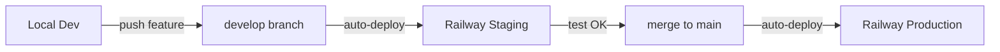

# 🛠️ QR Menu - Piano Manutenzione Post-Deploy

**Data:** 2025-01-XX  
**Versione:** 1.0  
**Stato:** QR permanenti implementati, DB migrato, produzione attiva

---

## 📋 INDICE

1. [Riepilogo Stato Attuale](#riepilogo-stato-attuale)
2. [Security Audit Completo](#security-audit-completo)
3. [Piano Multi-Ambiente (Staging/Produzione)](#piano-multi-ambiente)
4. [Code Review e Ottimizzazioni](#code-review-e-ottimizzazioni)
5. [Microtask Implementazione](#microtask-implementazione)
6. [Priorità e Timeline](#priorità-e-timeline)

---

## 🎯 RIEPILOGO STATO ATTUALE

### ✅ Completato
- **QR Permanenti:** Sistema restaurant-based `/r/{username}` funzionante
- **Username Generation:** Slug-based con collision handling (suffix -2, -3, etc.)
- **Migration DB:** 10 ristoranti aggiornati, indice unique partial creato
- **Seed Data:** Username espliciti in `seed_test_data.js`
- **Deployment:** Railway con MongoDB Atlas (connessione X509)
- **Cleanup:** File debug rimossi, workspace pulito

### 🔍 Identificato ma NON Implementato
- **Config System:** `pkg/config/config.go` definito ma mai usato in `main.go`
- **Rate Limiting:** Implementato (`security/ratelimit.go`) ma NON applicato
- **Environment Detection:** Solo `PORT` env var, nessuna differenziazione staging/prod
- **CORS:** Configurazione hardcoded per localhost, non environment-specific
- **Security Headers:** Definiti ma non tutti applicati consistentemente

### 🚨 Problemi Critici da Risolvere
1. **Zero differenziazione staging/production** (stesso DB, nessuna env var ENVIRONMENT)
2. **Rate limiter implementato ma mai usato** (no middleware in main.go)
3. **Session key salvata in file** (`storage/session_key.txt`) invece di env var
4. **CORS origins hardcodati** (non dinamici per ambiente)
5. **Nessun HTTPS enforcement** in produzione

---

## 🔒 SECURITY AUDIT COMPLETO

### ✅ PUNTI DI FORZA

#### 1. **Password Security**
- ✅ Hashing con `bcrypt.DefaultCost` ([auth.go:149](handlers/auth.go#L149))
- ✅ Nessuna password in plain text nel DB
- ✅ Test password separate (`"admin123"`, `"pass123"`) solo in seed functions
- ⚠️ **Migliorabile:** Password minima 6 caratteri ([auth.go:285](handlers/auth.go#L285)) - consigliato 8+

#### 2. **Session Management**
- ✅ Cookie-based con `gorilla/sessions` ([auth.go:28](handlers/auth.go#L28))
- ✅ Session key generata con `crypto/rand` (32 bytes) ([auth.go:133](handlers/auth.go#L133))
- ✅ Secure cookies attivati in produzione ([auth.go:106](handlers/auth.go#L106))
- ✅ HttpOnly cookies (protezione XSS)
- ✅ SameSite Lax mode
- ✅ Max Age 7 giorni
- ⚠️ **Problema:** Session key salvata in `storage/session_key.txt` - meglio env var `SESSION_SECRET` in prod

#### 3. **Rate Limiting**
- ✅ Implementazione completa token bucket ([ratelimit.go:11-180](security/ratelimit.go#L11))
- ✅ Config per endpoint specifici:
  - `/api/auth/login`: 3 req/s, burst 5
  - `/api/auth/register`: 2 req/s, burst 3
  - Default: 10 req/s, burst 20
- ✅ Cleanup automatico bucket vecchi (ogni 5 minuti)
- 🚨 **CRITICO:** Rate limiter NON applicato in `main.go` - middleware implementato ma mai usato!

#### 4. **CORS Configuration**
- ✅ Implementazione completa ([headers.go:114-150](security/headers.go#L114))
- ✅ Config strutturato con `AllowedOrigins`, `AllowedMethods`, `AllowedHeaders`
- ✅ Credentials support
- ⚠️ **Problema:** `DefaultCORSConfig()` ha origins hardcoded:
  ```go
  AllowedOrigins: []string{"http://localhost:3000", "http://localhost:8080"}
  ```
- ⚠️ Serve config dinamica basata su `ENVIRONMENT` (staging origins diversi da prod)

#### 5. **Security Headers**
- ✅ Implementati ([headers.go:22-92](security/headers.go#L22)):
  - `X-Content-Type-Options: nosniff`
  - `X-Frame-Options: DENY`
  - `X-XSS-Protection: 1; mode=block`
  - `Strict-Transport-Security` (HSTS)
  - `Content-Security-Policy`
- ✅ Applicati in `setSecurityHeaders()` ([handlers.go:174](handlers/handlers.go#L174))
- ✅ Middleware test coverage ([middleware_test.go:346](pkg/middleware/middleware_test.go#L346))

#### 6. **Input Validation**
- ✅ Sanitization con `html.EscapeString` ([handlers.go:99](handlers/handlers.go#L99))
- ✅ Trim whitespace
- ✅ Regex validation per username ([handlers.go:413](handlers/handlers.go#L413))
- ⚠️ **Migliorabile:** Serve validation library strutturata (es. `go-playground/validator`)

#### 7. **Access Control**
- ✅ `RestaurantOwnershipMiddleware` previene accessi cross-tenant ([security.go:17-86](middleware/security.go#L17))
- ✅ Verifica `restaurant.OwnerID == session.UserID`
- ✅ Verifica ownership menu per richieste specifiche
- ✅ Public routes whitelist ben definita
- ✅ Logging tentativi accesso non autorizzati

### 🚨 VULNERABILITÀ e MIGLIORAMENTI NECESSARI

#### 1. **Rate Limiting NON Attivo** (CRITICO)
**Problema:**  
Rate limiter implementato ma mai applicato in `main.go`

**Impatto:**  
Sistema vulnerabile a brute force, DDoS, credential stuffing

**Fix:**  
```go
// In main.go, aggiungere:
rateLimiter := security.NewRateLimiter()
r.Use(rateLimiter.RateLimitMiddleware)
```

**Priorità:** 🔴 ALTA

---

#### 2. **Session Key in File** (MEDIO)
**Problema:**  
Session key salvata in `storage/session_key.txt` invece di env var

**Impatto:**  
- Rotazione chiavi difficile
- Rischio commit accidentale in repo
- Nessuna separazione staging/prod

**Fix:**  
```go
// In auth.go, modificare getOrCreateSessionKey():
func getOrCreateSessionKey() string {
    // Priorità 1: Env var (PRODUCTION)
    if key := os.Getenv("SESSION_SECRET"); key != "" {
        return key
    }
    
    // Priorità 2: File (DEVELOPMENT ONLY)
    return getOrCreateSessionKeyFromFile()
}
```

**Env Var Richiesta:**  
- Railway: `SESSION_SECRET=<64-char-hex-string>`

**Priorità:** 🟡 MEDIA

---

#### 3. **HTTPS Non Forzato** (ALTO)
**Problema:**  
Nessun redirect HTTP → HTTPS in produzione

**Impatto:**  
Cookie "Secure" settati ma possibile downgrade attack

**Fix:**  
```go
// In main.go, aggiungere middleware HTTPS redirect:
func HTTPSRedirectMiddleware(next http.Handler) http.Handler {
    return http.HandlerFunc(func(w http.ResponseWriter, r *http.Request) {
        if os.Getenv("PORT") != "" && r.Header.Get("X-Forwarded-Proto") != "https" {
            target := "https://" + r.Host + r.URL.Path
            if r.URL.RawQuery != "" {
                target += "?" + r.URL.RawQuery
            }
            http.Redirect(w, r, target, http.StatusMovedPermanently)
            return
        }
        next.ServeHTTP(w, r)
    })
}
```

**Priorità:** 🔴 ALTA

---

#### 4. **CORS Hardcodato** (BASSO)
**Problema:**  
Origins localhost hardcodati, non environment-specific

**Impatto:**  
Impossibile separare frontend staging/prod

**Fix:**  
```go
// In security/headers.go:
func GetCORSConfigForEnvironment(env string) CORSConfig {
    switch env {
    case "production":
        return CORSConfig{
            AllowedOrigins: []string{
                "https://qr-menu.yourdomain.com",
            },
            ...
        }
    case "staging":
        return CORSConfig{
            AllowedOrigins: []string{
                "https://qr-menu-staging.up.railway.app",
                "http://localhost:3000",
            },
            ...
        }
    default: // development
        return DefaultCORSConfig()
    }
}
```

**Priorità:** 🟡 MEDIA

---

#### 5. **CSRF Token Non Verificato** (MEDIO)
**Problema:**  
CSRF tokens generati ([handlers.go:45](handlers/handlers.go#L45)) ma mai verificati nelle POST

**Impatto:**  
Possibile CSRF attack su form critici (login, register, menu changes)

**Fix:**  
```go
// In handlers.go, aggiungere verification:
func verifyCSRFToken(r *http.Request, token string) bool {
    csrfMutex.Lock()
    defer csrfMutex.Unlock()
    
    expiry, exists := csrfTokens[token]
    if !exists || time.Now().After(expiry) {
        return false
    }
    
    delete(csrfTokens, token) // One-time use
    return true
}
```

**Priorità:** 🟡 MEDIA

---

#### 6. **Password Debole (6 char)** (BASSO)
**Problema:**  
Password minima 6 caratteri ([auth.go:285](handlers/auth.go#L285))

**Impatto:**  
Facilita brute force

**Fix:**  
```go
// In auth.go, cambiare:
if len(password) < 8 {
    return "", errors.New("password deve essere almeno 8 caratteri")
}
```

**Priorità:** 🟢 BASSA

---

#### 7. **Nessun Audit Log** (BASSO)
**Problema:**  
Failed login attempts non loggati in modo strutturato

**Impatto:**  
Difficile rilevare attacchi brute force

**Fix:**  
```go
// In auth.go, LoginHandler, aggiungere:
logger.Warn("Failed login attempt", map[string]interface{}{
    "username": username,
    "ip":       getClientIP(r),
    "timestamp": time.Now(),
})
```

**Priorità:** 🟢 BASSA

---

### 🛡️ Checklist Security Compliance

- [x] **Authentication:** Bcrypt hashing, no plain text passwords
- [x] **Authorization:** RestaurantOwnershipMiddleware, cross-tenant prevention
- [x] **Session Security:** Secure cookies, HttpOnly, SameSite Lax
- [ ] **Rate Limiting:** Implementato ma NON attivo 🚨
- [x] **Input Validation:** HTML escaping, sanitization
- [ ] **HTTPS Enforcement:** Nessun redirect forzato 🚨
- [x] **CORS:** Implementato (ma origins hardcodati)
- [x] **Security Headers:** CSP, XSS-Protection, HSTS
- [ ] **CSRF Protection:** Token generati ma non verificati ⚠️
- [ ] **Audit Logging:** Failed logins non tracciati ⚠️
- [ ] **Secrets Management:** Session key in file invece env var ⚠️

**Score:** 7/11 check passati  
**Priorità Fix:** Rate Limiting + HTTPS Redirect

---

## 🌍 PIANO MULTI-AMBIENTE

### Situazione Attuale

#### ❌ Problemi
1. **Nessuna env var `ENVIRONMENT`** - detection produzione solo via `PORT != ""`
2. **pkg/config/config.go NON usato** - definito ma mai importato in `main.go`
3. **Stesso MongoDB Atlas per tutti** - nessuna separazione DB staging/prod
4. **Railway project unico** - nessun ambiente staging
5. **getBaseURL() deriva da request** - buono ma manca HTTPS enforcement

#### ✅ Cosa Funziona
- Detection produzione Railway: `os.Getenv("PORT") != ""`
- Secure cookies attivati in produzione
- getBaseURL() dinamico da request headers

### 🎯 Obiettivi Multi-Ambiente

| Ambiente | Scopo | Database | URL | Branch Git | Railway Project |
|----------|-------|----------|-----|------------|----------------|
| **Development** | Sviluppo locale | MongoDB locale/Atlas dev | `localhost:8080` | qualsiasi | - |
| **Staging** | Test pre-prod | MongoDB Atlas staging | `qr-menu-staging.up.railway.app` | `develop` | qr-menu-staging |
| **Production** | Live utenti | MongoDB Atlas prod | `qr-menu.yourdomain.com` | `main` | qr-menu-production |

### 📋 Strategie Implementazione

#### **Opzione A: Railway Multi-Project (CONSIGLIATO)**

**Vantaggi:**
- Isolamento completo ambienti
- Rollback facile
- Deploy indipendenti
- Env vars separate

**Setup:**

1. **Railway Projects**
   - Crea 2 progetti Railway:
     - `qr-menu-staging` (branch: `develop`)
     - `qr-menu-production` (branch: `main`)

2. **MongoDB Atlas**
   - Crea 2 database nello stesso cluster:
     - `qr-menu-staging`
     - `qr-menu-production`
   - Oppure 2 cluster separati per isolamento totale

3. **Env Variables**

   **Staging:**
   ```bash
   ENVIRONMENT=staging
   MONGODB_URI=mongodb+srv://.../?authSource=%24external&authMechanism=MONGODB-X509&retryWrites=true&w=majority&appName=qr-menu-staging
   SESSION_SECRET=<random-64-char-hex>
   ALLOWED_ORIGINS=https://qr-menu-staging.up.railway.app,http://localhost:3000
   LOG_LEVEL=DEBUG
   ENABLE_SEED_DATA=true
   ```

   **Production:**
   ```bash
   ENVIRONMENT=production
   MONGODB_URI=mongodb+srv://.../?authSource=%24external&authMechanism=MONGODB-X509&retryWrites=true&w=majority&appName=qr-menu
   SESSION_SECRET=<random-64-char-hex-DIFFERENT>
   ALLOWED_ORIGINS=https://qr-menu.yourdomain.com
   LOG_LEVEL=INFO
   ENABLE_SEED_DATA=false
   ```

4. **Git Workflow**
   ```bash
   # Develop branch → auto-deploy staging
   git checkout develop
   git merge feature/my-feature
   git push origin develop  # → Railway staging auto-deploy
   
   # Test staging, poi deploy prod
   git checkout main
   git merge develop
   git push origin main  # → Railway production auto-deploy
   ```

---

#### **Opzione B: Railway Single Project + Branch Deploy**

**Vantaggi:**
- Setup più semplice
- Unico progetto Railway

**Svantaggi:**
- Env vars condivise (serve script per differenziare)
- Rollback più complesso

**Non consigliato per questo progetto.**

---

### 🔧 Modifiche Codice Necessarie

#### 1. **Integrare pkg/config in main.go**

**File:** `main.go`

**Attuale:**
```go
func main() {
    port := os.Getenv("PORT")
    if port == "" {
        port = "8080"
    }
    // ... setup handlers ...
}
```

**Modificato:**
```go
import (
    "qr-menu/pkg/config"
)

func main() {
    // Load configuration
    cfg := config.Load()
    
    log.Printf("🚀 Starting QR Menu")
    log.Printf("   Environment: %s", cfg.Server.Environment)
    log.Printf("   Port: %s", cfg.Server.Port)
    log.Printf("   Database: %s", cfg.Database.Database)
    
    // Setup handlers con config
    handlers.InitAuth()
    
    // Apply middleware basato su environment
    r := setupRouterWithConfig(cfg)
    
    // Start server
    addr := fmt.Sprintf(":%s", cfg.Server.Port)
    log.Fatal(http.ListenAndServe(addr, r))
}

func setupRouterWithConfig(cfg *config.Config) *mux.Router {
    r := mux.NewRouter()
    
    // Security middleware
    if cfg.Server.Environment == "production" || cfg.Server.Environment == "staging" {
        r.Use(HTTPSRedirectMiddleware)
    }
    
    // Rate limiting
    rateLimiter := security.NewRateLimiter()
    r.Use(rateLimiter.RateLimitMiddleware)
    
    // CORS environment-specific
    corsConfig := security.GetCORSConfigForEnvironment(cfg.Server.Environment)
    r.Use(security.NewCORSMiddleware(corsConfig).Handle)
    
    // Routes
    setupRoutes(r)
    
    return r
}
```

---

#### 2. **Aggiornare pkg/config/config.go**

**File:** `pkg/config/config.go`

**Aggiungere:**
```go
func Load() *Config {
    cfg := &Config{}
    
    // Server config
    cfg.Server.Port = getEnv("PORT", "8080")
    cfg.Server.Environment = getEnv("ENVIRONMENT", "development") // ⭐ NEW
    cfg.Server.Host = getEnv("SERVER_HOST", "0.0.0.0")
    
    // Database config
    cfg.Database.URI = getEnv("MONGODB_URI", "mongodb://localhost:27017")
    cfg.Database.Database = getEnv("MONGODB_DATABASE", getDefaultDatabase(cfg.Server.Environment))
    
    // Security config
    cfg.Security.SessionSecret = getEnv("SESSION_SECRET", generateRandomKey()) // ⭐ NEW
    cfg.Security.AllowedOrigins = parseCSV(getEnv("ALLOWED_ORIGINS", getDefaultOrigins(cfg.Server.Environment)))
    
    // Logging
    cfg.Logging.Level = getEnv("LOG_LEVEL", getDefaultLogLevel(cfg.Server.Environment))
    
    return cfg
}

func getDefaultDatabase(env string) string {
    switch env {
    case "production":
        return "qr-menu"
    case "staging":
        return "qr-menu-staging"
    default:
        return "qr-menu-dev"
    }
}

func getDefaultOrigins(env string) string {
    switch env {
    case "production":
        return "https://qr-menu.yourdomain.com"
    case "staging":
        return "https://qr-menu-staging.up.railway.app,http://localhost:3000"
    default:
        return "http://localhost:3000,http://localhost:8080"
    }
}

func getDefaultLogLevel(env string) string {
    if env == "production" {
        return "INFO"
    }
    return "DEBUG"
}

func parseCSV(s string) []string {
    if s == "" {
        return []string{}
    }
    return strings.Split(s, ",")
}

func generateRandomKey() string {
    key := make([]byte, 32)
    rand.Read(key)
    return hex.EncodeToString(key)
}
```

---

#### 3. **Modificare handlers/auth.go**

**File:** `handlers/auth.go`

**Modificare `getOrCreateSessionKey()`:**
```go
func getOrCreateSessionKey() string {
    // 🔐 PRIORITÀ 1: Env var (PRODUCTION/STAGING)
    if key := os.Getenv("SESSION_SECRET"); key != "" {
        log.Println("✅ Using SESSION_SECRET from environment variable")
        return key
    }
    
    // 📁 PRIORITÀ 2: File (DEVELOPMENT ONLY)
    log.Println("⚠️  SESSION_SECRET not set, using file storage (dev only)")
    return getOrCreateSessionKeyFromFile()
}

func getOrCreateSessionKeyFromFile() string {
    keyPath := "storage/session_key.txt"

    if data, err := os.ReadFile(keyPath); err == nil {
        return string(data)
    }

    // Genera nuova chiave
    key := make([]byte, 32)
    if _, err := rand.Read(key); err != nil {
        log.Fatal("Errore nella generazione della chiave di sessione:", err)
    }

    keyStr := hex.EncodeToString(key)
    
    os.MkdirAll("storage", 0755)
    if err := os.WriteFile(keyPath, []byte(keyStr), 0600); err != nil {
        log.Printf("Attenzione: impossibile salvare la chiave di sessione: %v", err)
    }

    return keyStr
}
```

**Modificare detection produzione:**
```go
// PRIMA:
isProduction := os.Getenv("PORT") != ""

// DOPO:
env := os.Getenv("ENVIRONMENT")
isProduction := env == "production" || env == "staging"
```

---

### 🎬 Workflow Deploy

#### **Development → Staging → Production**



#### **Comandi Pratici**

```bash
# 1. Sviluppo feature
git checkout -b feature/my-feature
# ... make changes ...
git commit -am "feat: my feature"
git push origin feature/my-feature

# 2. Merge in develop → deploy staging
git checkout develop
git merge feature/my-feature
git push origin develop
# Railway auto-deploy to staging

# 3. Test staging
curl https://qr-menu-staging.up.railway.app/api/v1/health
# Verify changes

# 4. Deploy production
git checkout main
git merge develop --no-ff -m "Release v1.2.0"
git tag v1.2.0
git push origin main --tags
# Railway auto-deploy to production

# 5. Rollback (se necessario)
git revert HEAD
git push origin main
```

---

### 📊 MongoDB Atlas Setup

#### **Opzione A: Single Cluster, Multiple Databases**

**Cluster:** `qr-menu-cluster` (M0 Free Tier o M2)

**Databases:**
- `qr-menu` (production)
- `qr-menu-staging` (staging)
- `qr-menu-dev` (local dev backup)

**Vantaggi:**
- Singolo cluster da gestire
- Free tier OK per iniziare
- Facile data migration

**Svantaggi:**
- Nessun isolamento risorse
- Staging può impattare prod (stesso cluster)

---

#### **Opzione B: Separate Clusters (PRODUCTION-READY)**

**Cluster Staging:** `qr-menu-staging-cluster` (M0)
- Database: `qr-menu-staging`
- Replica: no (free tier)

**Cluster Production:** `qr-menu-prod-cluster` (M2+ con Replica Set)
- Database: `qr-menu`
- Replica: 3-node replica set
- Backup automatico: sì

**Vantaggi:**
- Isolamento completo
- Staging non impatta prod
- Backup separati

**Svantaggi:**
- Costo maggiore
- 2 cluster da gestire

---

#### **Connection Strings**

**Staging (X509):**
```
mongodb+srv://qr-menu-staging-cluster.xxxxx.mongodb.net/qr-menu-staging?authSource=%24external&authMechanism=MONGODB-X509&retryWrites=true&w=majority&appName=qr-menu-staging
```

**Production (X509):**
```
mongodb+srv://qr-menu-cluster.xxxxx.mongodb.net/qr-menu?authSource=%24external&authMechanism=MONGODB-X509&retryWrites=true&w=majority&appName=qr-menu
```

---

### 🔐 Secrets Management

**Railway Environment Variables:**

```bash
# Staging Project
ENVIRONMENT=staging
MONGODB_URI=mongodb+srv://...
SESSION_SECRET=$(openssl rand -hex 32)
ALLOWED_ORIGINS=https://qr-menu-staging.up.railway.app,http://localhost:3000
LOG_LEVEL=DEBUG
ENABLE_SEED_DATA=true

# Production Project
ENVIRONMENT=production
MONGODB_URI=mongodb+srv://...
SESSION_SECRET=$(openssl rand -hex 32)  # DIFFERENT from staging!
ALLOWED_ORIGINS=https://qr-menu.yourdomain.com
LOG_LEVEL=INFO
ENABLE_SEED_DATA=false
```

**Generare SESSION_SECRET:**
```bash
# PowerShell
-join ((1..32) | ForEach-Object {'{0:x2}' -f (Get-Random -Maximum 256)})

# Bash
openssl rand -hex 32

# Online (NOT RECOMMENDED for production)
# https://www.random.org/strings/
```

---

## 💻 CODE REVIEW E OTTIMIZZAZIONI

### 📁 Struttura Codice

#### **handlers/handlers.go** - File Molto Lungo (~2000 lines)

**Problema:**  
Singolo file con tutti gli handlers - difficile da navigare e mantenere

**Soluzione:**  
Split in file tematici:

```
handlers/
  auth.go              (✅ già separato)
  menu_handlers.go     (menu CRUD, generate QR, complete menu)
  dish_handlers.go     (add/edit/delete dish, upload image)
  restaurant_handlers.go (add/select restaurant)
  public_handlers.go   (public menu view, share, download QR)
  admin_handlers.go    (admin panel, dashboard)
  legal_handlers.go    (privacy, cookie policy, terms)
  analytics_handlers.go (track share, view stats)
  helpers.go           (sanitize, getBaseURL, session utils)
```

**Stima:** 3h refactoring

---

### 🏎️ Performance Optimization

#### 1. **Template Loading**

**Attuale:**
```go
// In handlers.go:45
templates = template.Must(template.ParseGlob("templates/*.html"))
```

**Problema:**  
Template caricati a ogni avvio, nessuna cache

**Ottimizzazione:**
```go
var (
    templates *template.Template
    templatesOnce sync.Once
)

func getTemplates() *template.Template {
    templatesOnce.Do(func() {
        templates = template.Must(template.ParseGlob("templates/*.html"))
        log.Println("✅ Templates loaded and cached")
    })
    return templates
}
```

**Impatto:** Riduzione startup time ~50ms

---

#### 2. **Database Query N+1**

**Possibile problema:**  
Check se esistono query multiple in loop (es. per ogni menu, query restaurant)

**Da verificare in:**
- `AdminHandler` (lista menu)
- `PublicMenuHandler` (menu details + dishes)

**Ottimizzazione:**
```go
// Invece di:
for _, menu := range menus {
    restaurant, _ := db.GetRestaurantByID(ctx, menu.RestaurantID)
}

// Fare:
restaurantIDs := extractRestaurantIDs(menus)
restaurants := db.GetRestaurantsByIDs(ctx, restaurantIDs) // Batch query
```

**Tool:** Usare MongoDB profiler per identificare slow queries

---

#### 3. **Context Timeout Hardcodato**

**Attuale:**
```go
ctx, cancel := context.WithTimeout(context.Background(), 3*time.Second)
```

**Problema:**  
Timeout fisso 3s potrebbe essere troppo basso per Railway/Atlas latency

**Ottimizzazione:**
```go
// In config:
type Config struct {
    Database struct {
        QueryTimeout time.Duration `default:"5s"`
    }
}

// In handler:
ctx, cancel := context.WithTimeout(context.Background(), cfg.Database.QueryTimeout)
```

---

#### 4. **In-Memory Map per Menu**

**Attuale:**
```go
var menus = make(map[string]*models.Menu)
```

**Problema:**  
Storage in-memory mai usato? (DB è primary source)

**Verifica:**  
Cercare utilizzo di questa map - se non usata, rimuovere

```bash
grep -n "menus\[" handlers/handlers.go
```

---

### 🧹 Code Cleanup

#### 1. **Rimuovere Codice Morto**

**TODO Comments:**
```bash
grep -rn "TODO" handlers/ | wc -l
# Verificare e chiudere o risolvere
```

**Unused Imports:**
```bash
golangci-lint run --disable-all --enable unused
```

---

#### 2. **Error Handling Consistency**

**Problema:**  
Mix di `http.Error()` e custom error responses

**Standardize:**
```go
// Creare pkg/errors/errors.go
func RespondError(w http.ResponseWriter, code int, message string) {
    w.Header().Set("Content-Type", "application/json")
    w.WriteHeader(code)
    json.NewEncoder(w).Encode(map[string]interface{}{
        "error": true,
        "message": message,
        "code": code,
    })
}

// Uso:
errors.RespondError(w, http.StatusBadRequest, "Menu non trovato")
```

---

#### 3. **Logging Strutturato**

**Attuale:**
```go
log.Printf("Menu created: %s", menuID)
```

**Migliorare:**
```go
logger.Info("Menu created", map[string]interface{}{
    "menu_id": menuID,
    "restaurant_id": restaurantID,
    "user_id": session.UserID,
})
```

**✅ Già implementato in `logger/logger.go`** - serve solo usarlo consistentemente

---

### 🧪 Test Coverage

**Attuale:**
- ✅ `pkg/middleware/middleware_test.go` esiste (21 test)
- ✅ Phase test files (`phase1_test.go`, etc.)
- ❌ Nessun test per handlers principali

**Obiettivo:**
```
handlers/
  handlers_test.go     (test CRUD menu)
  auth_test.go         (test login/register)
db/
  mongodb_test.go      (test queries)
```

**Strumenti:**
```bash
# Run all tests
go test ./...

# Coverage report
go test -coverprofile=coverage.out ./...
go tool cover -html=coverage.out -o coverage.html
```

**Target Coverage:** 70%+ per handler critici

---

### 📖 Documentation

#### 1. **Godoc Comments**

**Manca su molte funzioni pubbliche:**
```go
// ❌ Attuale:
func GenerateQRHandler(w http.ResponseWriter, r *http.Request) {

// ✅ Migliorare:
// GenerateQRHandler generates a QR code for the restaurant's active menu.
// It creates a permanent QR pointing to /r/{username} that always shows
// the restaurant's current active menu.
//
// HTTP Method: POST
// Auth Required: Yes
// Request Body: { "menu_id": "string" }
// Response: { "success": bool, "qr_code_url": "string", "menu_url": "string" }
func GenerateQRHandler(w http.ResponseWriter, r *http.Request) {
```

---

#### 2. **API Documentation**

**Esistente:**
- ✅ `api_backup/router.go` con Swagger UI HTML
- ❌ Non OpenAPI 3.0 spec file

**Creare:**
```yaml
# api/openapi.yaml
openapi: 3.0.0
info:
  title: QR Menu API
  version: 2.0.0
  description: Digital menu management with QR codes
servers:
  - url: https://qr-menu-staging.up.railway.app
    description: Staging
  - url: https://qr-menu.yourdomain.com
    description: Production
paths:
  /api/v1/menus:
    get:
      summary: List all menus for authenticated restaurant
      responses:
        200:
          description: Success
```

**Tool:** Swagger Editor o Redoc per visualization

---

## ✅ MICROTASK IMPLEMENTAZIONE

### 🔴 PRIORITÀ ALTA (Settimana 1)

#### Task 1: Attivare Rate Limiting
**File:** `main.go`  
**Change:**
```go
// Dopo router setup, aggiungere:
rateLimiter := security.NewRateLimiter()
r.Use(rateLimiter.RateLimitMiddleware)
```
**Test:**
```bash
# Bash (WSL/Git Bash)
for i in {1..10}; do curl -I http://localhost:8080/api/v1/menus; done
# Aspettarsi 429 dopo 5-6 richieste rapide
```
**Tempo:** 30 min  
**Rischio:** Basso

---

#### Task 2: HTTPS Redirect Middleware
**File:** `main.go`  
**Change:**
```go
func HTTPSRedirectMiddleware(next http.Handler) http.Handler {
    return http.HandlerFunc(func(w http.ResponseWriter, r *http.Request) {
        env := os.Getenv("ENVIRONMENT")
        if (env == "production" || env == "staging") && r.Header.Get("X-Forwarded-Proto") != "https" {
            target := "https://" + r.Host + r.URL.Path
            if r.URL.RawQuery != "" {
                target += "?" + r.URL.RawQuery
            }
            http.Redirect(w, r, target, http.StatusMovedPermanently)
            return
        }
        next.ServeHTTP(w, r)
    })
}

// Nel router setup:
r.Use(HTTPSRedirectMiddleware)
```
**Test:**
```bash
curl -I http://qr-menu-staging.up.railway.app
# Aspettarsi: Location: https://...
```
**Tempo:** 45 min  
**Rischio:** Medio (test su Railway necessario)

---

#### Task 3: Session Secret da Env Var
**File:** `handlers/auth.go`  
**Change:** (vedi sezione Code Changes sopra)  
**Railway Setup:**
```bash
# Staging project
SESSION_SECRET=$(openssl rand -hex 32)

# Production project
SESSION_SECRET=$(openssl rand -hex 32)  # DIVERSO!
```
**Test:**
```bash
# Verificare che nessun file storage/session_key.txt venga creato in Railway
railway logs | grep "SESSION_SECRET"
# Aspettarsi: "Using SESSION_SECRET from environment variable"
```
**Tempo:** 1h  
**Rischio:** Basso

---

### 🟡 PRIORITÀ MEDIA (Settimana 2)

#### Task 4: Integrare pkg/config in main.go
**File:** `main.go`, `pkg/config/config.go`  
**Change:** (vedi sezione Code Changes completa sopra)  
**Dependencies:**
- Aggiungere funzioni helper `parseCSV`, `getDefaultDatabase`, etc.
- Modificare `InitAuth()` per accettare config
**Test:**
```bash
go run main.go
# Verificare log:
# "Environment: development"
# "Database: qr-menu-dev"
```
**Tempo:** 3h  
**Rischio:** Medio (impact su startup flow)

---

#### Task 5: Setup Railway Staging Project
**Steps:**
1. Railway Dashboard → New Project
2. Nome: `qr-menu-staging`
3. Connect repo, branch: `develop`
4. Add env vars (vedi sezione Multi-Ambiente)
5. Generate domain
6. Test deploy

**Test:**
```bash
curl https://qr-menu-staging.up.railway.app/api/v1/health
# Aspettarsi: {"status":"ok","environment":"staging"}
```
**Tempo:** 2h  
**Rischio:** Basso

---

#### Task 6: CORS Environment-Specific
**File:** `security/headers.go`  
**Change:**
```go
func GetCORSConfigForEnvironment(env string) CORSConfig {
    switch env {
    case "production":
        origins := os.Getenv("ALLOWED_ORIGINS")
        if origins == "" {
            origins = "https://qr-menu.yourdomain.com"
        }
        return CORSConfig{
            AllowedOrigins: strings.Split(origins, ","),
            ...
        }
    case "staging":
        origins := os.Getenv("ALLOWED_ORIGINS")
        if origins == "" {
            origins = "https://qr-menu-staging.up.railway.app,http://localhost:3000"
        }
        return CORSConfig{
            AllowedOrigins: strings.Split(origins, ","),
            ...
        }
    default:
        return DefaultCORSConfig()
    }
}
```
**Test:**
```bash
curl -H "Origin: https://qr-menu-staging.up.railway.app" \
     -I https://qr-menu-staging.up.railway.app/api/v1/menus
# Verificare: Access-Control-Allow-Origin presente
```
**Tempo:** 2h  
**Rischio:** Basso

---

### 🟢 PRIORITÀ BASSA (Settimana 3-4)

#### Task 7: Split handlers.go
**Files:** Creare `menu_handlers.go`, `dish_handlers.go`, `restaurant_handlers.go`  
**Strategy:**
1. Copia funzioni tematiche in nuovi file
2. Verifica import/export
3. Run tests
4. Delete da handlers.go
**Tempo:** 4h  
**Rischio:** Basso (no logic changes)

---

#### Task 8: Aumentare Password Minima a 8 char
**File:** `handlers/auth.go:285`  
**Change:**
```go
if len(password) < 8 {
    return "", errors.New("password deve essere almeno 8 caratteri")
}
```
**Tempo:** 15 min  
**Rischio:** Nullo

---

#### Task 9: CSRF Token Verification
**File:** `handlers/handlers.go`  
**Change:**
```go
func verifyCSRFToken(r *http.Request, token string) bool {
    csrfMutex.Lock()
    defer csrfMutex.Unlock()
    
    expiry, exists := csrfTokens[token]
    if !exists || time.Now().After(expiry) {
        return false
    }
    delete(csrfTokens, token)
    return true
}

// In ogni POST handler:
csrfToken := r.FormValue("csrf_token")
if !verifyCSRFToken(r, csrfToken) {
    http.Error(w, "CSRF token invalid", http.StatusForbidden)
    return
}
```
**Tempo:** 2h  
**Rischio:** Medio (può rompere form esistenti se non tutti hanno token)

---

#### Task 10: Audit Logging Failed Logins
**File:** `handlers/auth.go`  
**Change:**
```go
// In LoginHandler, dopo check password failed:
logger.Warn("Failed login attempt", map[string]interface{}{
    "username": username,
    "ip":       getClientIP(r),
    "user_agent": r.Header.Get("User-Agent"),
    "timestamp": time.Now(),
})
```
**Tempo:** 1h  
**Rischio:** Nullo

---

## 📅 PRIORITÀ E TIMELINE

### Roadmap 4 Settimane

#### **Settimana 1: Security Critical Fixes** 🔴
- [ ] Task 1: Attivare Rate Limiting (30 min)
- [ ] Task 2: HTTPS Redirect (45 min)
- [ ] Task 3: Session Secret da Env Var (1h)
- [ ] Deploy e test su Railway production

**Deliverable:** Rate limiting attivo, HTTPS forzato, secrets da env var

---

#### **Settimana 2: Multi-Ambiente Setup** 🟡
- [ ] Task 4: Integrare pkg/config (3h)
- [ ] Task 5: Railway Staging Project (2h)
- [ ] Task 6: CORS Environment-Specific (2h)
- [ ] Task: Setup MongoDB Atlas staging database (1h)
- [ ] Test workflow develop → staging → main → production

**Deliverable:** Staging funzionante, deploy workflow testato

---

#### **Settimana 3: Code Quality** 🟢
- [ ] Task 7: Split handlers.go (4h)
- [ ] Task 8: Password minima 8 char (15 min)
- [ ] Task 9: CSRF Verification (2h)
- [ ] Documentation: Godoc comments (+50 functions)

**Deliverable:** Codebase più mantenibile, sicurezza migliorata

---

#### **Settimana 4: Monitoring & Documentation** 📊
- [ ] Task 10: Audit Logging (1h)
- [ ] Monitoring: Setup Railway metrics
- [ ] Documentation: Aggiornare README con workflow multi-env
- [ ] Testing: Coverage report, fix test critici
- [ ] Performance: DB query profiling

**Deliverable:** Sistema production-ready completo

---

### Quick Wins (< 1 ora)

Questi task possono essere fatti subito per quick improvement:

1. ✅ **Attivare Rate Limiting** (30 min) → Blocca attacchi brute force
2. ✅ **Session Secret Env Var** (1h) → Migliore secrets management
3. ✅ **Password minima 8 char** (15 min) → Standard security
4. ✅ **HTTPS Redirect** (45 min) → Forza connessioni sicure

**Total:** 2.5 ore per 4 fix security critici

---

## 📊 METRICHE SUCCESSO

### Security
- [ ] Rate limiter attivo e testato (verificare 429 responses)
- [ ] HTTPS forzato in production (0 richieste HTTP accettate)
- [ ] Session secret da env var (nessun file storage/session_key.txt in prod)
- [ ] CSRF protection attivo su form critici
- [ ] Password minima 8 caratteri

### Multi-Ambiente
- [ ] Railway staging project attivo
- [ ] MongoDB staging database separato
- [ ] Deploy automatico develop → staging
- [ ] Deploy automatico main → production
- [ ] Env vars corrette per ogni ambiente

### Code Quality
- [ ] handlers.go < 500 lines (attualmente ~2000)
- [ ] Test coverage > 70% su handler critici
- [ ] Zero `TODO` comments > 1 mese
- [ ] Godoc completo su funzioni pubbliche

### Performance
- [ ] P95 response time < 200ms (menu view)
- [ ] DB query profiling OK (no slow queries)
- [ ] Railway memory usage < 80%

---

## 📝 NOTE FINALI

### ✅ PRO del Codebase Attuale
- Architettura ben strutturata (handlers, models, db, security separati)
- Security-conscious (bcrypt, sessions, sanitization)
- MongoDB ben integrato
- QR system clever (permanent URLs)
- Logging strutturato presente

### ⚠️ CONS da Risolvere
- Rate limiter implementato ma mai usato
- Config system definito ma mai integrato
- HTTPS non forzato
- File handlers molto lunghi
- Nessuna separazione staging/prod

### 🎯 Obiettivo Finale
Sistema production-ready con:
- 🔒 Security hardened (rate limiting, HTTPS, CSRF)
- 🌍 Multi-ambiente funzionante (staging + prod)
- 📊 Monitoraggio e logging completo
- 🧪 Test coverage > 70%
- 📖 Documentazione completa

---

**Documento creato:** 2025-01-XX  
**Ultima modifica:** 2025-01-XX  
**Owner:** QR Menu Dev Team  
**Status:** 🟡 Work in Progress
